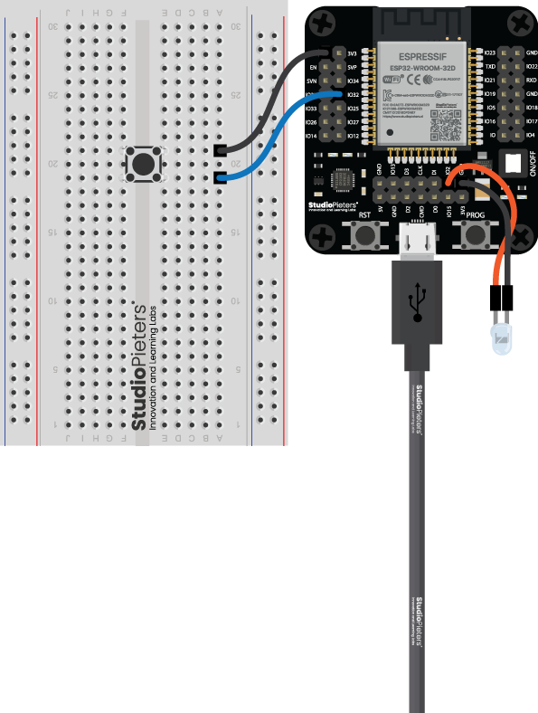

# HomeKit Sunshade for ESP32

This project implements a complete HomeKit window covering accessory for ESP32 based on the
StudioPieters® sunshade controller firmware. It combines relay control, physical buttons,
status lighting and the Lifecycle Manager (LCM) helper library to deliver a polished user
experience that can be provisioned through the Home app.



## Features

- **HomeKit Window Covering service** with current/target position tracking, obstruction
  reporting and optional momentary *Recalibrate* switch.
- **Lifecycle Manager integration** for NVS initialization, OTA trigger exposure and
  automatic boot diagnostics.
- **Persistent calibration**: the full travel time is measured once and stored in NVS so the
  shade position stays in sync after reboots.
- **Three hard-wired buttons** (OPEN, STOP, CLOSE) with single/double/long press handling via
  [`esp32-button`](https://github.com/achimpieters/esp32-button).
- **Status lighting**: a discrete LED plus a NeoPixel provide feedback for Wi-Fi provisioning,
  movement, calibration and idle states.
- **Relay interlock** that guarantees OPEN and CLOSE coils are never energized at the same
  time.

## Button behaviour

| Button | Action | Notes |
| ------ | ------ | ----- |
| OPEN   | Single press | Moves the shade to 100 % (or starts the calibration run when armed). |
| STOP   | Single press | Stops movement; during calibration it finalizes the measurement. |
| STOP   | Double press | Moves the shade to the configured mid position (50 % by default). |
| STOP   | Long press | Toggles calibration mode (armed ↔ idle). |
| CLOSE  | Single press | Moves the shade to 0 %. |

During calibration the NeoPixel glows purple and the controller measures the time needed to
open fully. The resulting travel time is written to NVS so future moves scale correctly.

## HomeKit characteristics

- Window Covering service (primary) with OTA trigger and hold-position support.
- Accessory Information service with StudioPieters® metadata.
- Optional Switch service exposed as **Recalibrate**, mirroring the STOP button long press.

Set the HomeKit setup code and ID in `menuconfig` (`CONFIG_ESP_SETUP_CODE` and
`CONFIG_ESP_SETUP_ID`).

## Hardware configuration

All GPIO assignments are configurable through `menuconfig` and checked into
`main/Kconfig.projbuild`:

| Function | Kconfig option |
| -------- | -------------- |
| Identify LED | `CONFIG_ESP_LED_GPIO` |
| NeoPixel DIN | `CONFIG_NEOPIXEL_GPIO` |
| Relay – Open | `CONFIG_ESP_OPEN_GPIO` |
| Relay – Close | `CONFIG_ESP_CLOSE_GPIO` |
| Button – Open | `CONFIG_BTN_OPEN_GPIO` |
| Button – Stop | `CONFIG_BTN_STOP_GPIO` |
| Button – Close | `CONFIG_BTN_CLOSE_GPIO` |
| Button active level | `CONFIG_BUTTON_ACTIVE_LEVEL` |
| Relay active level | `CONFIG_RELAY_ACTIVE_LEVEL` |

Classic ESP32 pins (0–39) are supported out of the box. Consult the comments in
`main/main.c` for suggested pin mappings when targeting ESP32-S3 or ESP32-C3 variants.

## Building and flashing

1. Install [ESP-IDF 5.x](https://docs.espressif.com/projects/esp-idf/en/latest/esp32/get-started/).
2. Clone this repository together with its managed components (the `idf.py set-target` and
   `idf.py add-dependency` commands are handled automatically via `main/idf_component.yml`).
3. Configure the project:
   ```bash
   idf.py menuconfig
   ```
   Set the GPIO numbers, Wi-Fi credentials (if you use the Wi-Fi provisioning example) and
   the HomeKit setup payload.
4. Build and flash:
   ```bash
   idf.py build
   idf.py -p /dev/ttyUSB0 flash monitor
   ```

After the first boot the accessory enters provisioning mode. Add it from the Apple Home app
using the setup code you configured. Once paired, you can trigger OTA updates from the Home
app or via the STOP button single press (which maps to the Lifecycle Manager OTA request).

## Troubleshooting tips

- If the shade moves too far or not far enough, enter calibration mode with a long press on
  the STOP button, fully close the shade, press OPEN to start, then press STOP when fully open.
- NeoPixel colour legend:
  - **Orange breathing** – waiting for Wi-Fi provisioning.
  - **Green/Red solid** – opening/closing.
  - **Cyan solid** – stopped mid-travel.
  - **Purple breathing** – calibration active.
  - **Soft white** – idle and connected.
- The firmware revision displayed in HomeKit comes from `LIFECYCLE_DEFAULT_FW_VERSION` in the
  Lifecycle Manager component. Update it when publishing new firmware builds.

## License

Distributed under the same terms as the original StudioPieters® firmware (see `LICENSE`).
