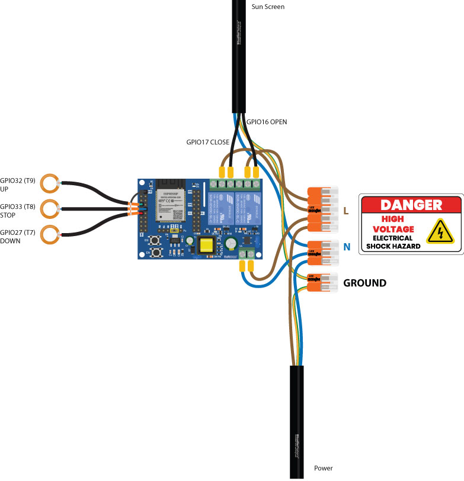

# HomeKit Sunshade – ESP32-WROOM-32D

A complete **Apple HomeKit Window Covering** accessory for the ESP32-WROOM-32D built with ESP-IDF v5.  
It replaces a standard UP/DOWN/STOP switch and adds HomeKit control, capacitive touch buttons, time-based position tracking, calibration, and automatic power-loss recovery.

---

## Table of Contents

1. [Feature overview](#1-feature-overview)
2. [Hardware](#2-hardware)
3. [GPIO pinout](#3-gpio-pinout)
4. [Build and flash](#4-build-and-flash)
5. [First-time setup](#5-first-time-setup)
6. [Calibration procedure](#6-calibration-procedure)
7. [Power-loss recovery](#7-power-loss-recovery)
8. [HomeKit position control](#8-homekit-position-control)
9. [Touch buttons](#9-touch-buttons)
10. [Physical button](#10-physical-button)
11. [Identify LED](#11-identify-led)
12. [OTA updates](#12-ota-updates)
13. [Menuconfig reference](#13-menuconfig-reference)
14. [NVS storage layout](#14-nvs-storage-layout)
15. [How position tracking works](#15-how-position-tracking-works)
16. [Troubleshooting](#16-troubleshooting)
17. [Requirements](#17-requirements)

---

## 1. Feature overview

| Feature | Details |
|---------|---------|
| **HomeKit service** | `WINDOW_COVERING` – current position, target position, position state, hold position |
| **Accessory category** | Window Covering (tile icon in the Home app) |
| **Relay outputs** | GPIO16 (OPEN/UP), GPIO17 (CLOSE/DOWN) with software interlock |
| **Touch buttons** | TTP223 capacitive modules: UP (GPIO32), STOP (GPIO33), DOWN (GPIO27) |
| **Physical button** | Push button on GPIO25: single/double/long press |
| **Identify LED** | GPIO23 – blinks on HomeKit Identify, not visible as a service |
| **Calibration** | Measures actual motor travel time; saved to NVS flash |
| **Power-loss recovery** | On boot: closes fully, then restores last HomeKit position |
| **Position tracking** | Time-based, 0–100 %, notified on change (max every 500 ms, HAP-compliant) |
| **OTA** | Firmware update via HomeKit custom characteristic or single button press |
| **Lifecycle Manager** | WiFi, NVS, factory reset, reboot counter via `esp32-lcm` |

---

## 2. Hardware

### Required components

| Component | Quantity | Notes |
|-----------|----------|-------|
| ESP32-WROOM-32D | 1 | Any ESP32 module with sufficient GPIOs |
| Relay module (2-channel) | 1 | One relay per direction; optoisolated recommended |
| Copper ring / touch pad | 3 | UP, STOP, DOWN – with shielded cable and ground shield |
| Push button (momentary) | 1 | NO type, wired GND → button → GPIO25 |
| LED + current-limiting resistor | 1 | Identify LED on GPIO23 |

### Schematic



### Relay wiring

The two relay outputs switch the motor direction:

```
OPEN relay (GPIO16) ──► motor terminal A power
CLOSE relay (GPIO17) ──► motor terminal B power
GND (common) ──────────► motor common
```

> **Important:** Never wire OPEN and CLOSE to the same motor terminal simultaneously. The software interlock already prevents both relays from being energised at the same time, but double-check your wiring.

### Touch pad construction

Each capacitive button consists of:
- A **copper ring or pad** as the sensing electrode
- A **shielded cable** (braid connected to GND) to prevent false positives from cable routing
- A **ground plane** around the pad where possible

The pads connect directly to the ESP32 touch channel pins. No additional components are needed.

---

## 3. GPIO pinout

| GPIO | Function | Direction | Notes |
|------|----------|-----------|-------|
| **GPIO16** | OPEN / UP relay | Output | Active HIGH; motor runs UP |
| **GPIO17** | CLOSE / DOWN relay | Output | Active HIGH; motor runs DOWN |
| **GPIO23** | Identify LED | Output | Blinks on HomeKit Identify |
| **GPIO25** | Physical push button | Input | GND → button → GPIO25; active-low |
| **GPIO27** | TTP223 DOWN signal | Digital input | Active-high; close/lower sunshade |
| **GPIO32** | TTP223 UP signal | Digital input | Active-high; open/raise sunshade |
| **GPIO33** | TTP223 STOP signal | Digital input | Active-high; stop + calibration trigger |

All defaults are configurable via `idf.py menuconfig` → **StudioPieters**.

---

## 4. Build and flash

```bash
git clone https://github.com/AchimPieters/esp32-homekit-Sunshade.git
cd esp32-homekit-Sunshade

# Set target (once per checkout)
idf.py set-target esp32

# Optional: adjust GPIOs, travel time, HomeKit code
idf.py menuconfig

# Build, flash and monitor
idf.py build flash monitor
```

> If `idf.py set-target` fails with a CMake error, remove the stale build folder first:
> ```bash
> rm -rf build && idf.py set-target esp32
> ```

### Provision WiFi

On first boot, WiFi credentials are not stored. Use any ESP-IDF provisioning method (e.g. `esp-idf-prov` app on iOS/Android) to configure the SSID and password. The device will remember the credentials across reboots.

---

## 5. First-time setup

1. **Flash** the firmware.
2. **Provision WiFi** (see above).
3. **Pair** with HomeKit using the QR code or the setup code printed in `menuconfig` (default: `582-94-633`).
4. **Calibrate** the sunshade so the device learns how long your motor takes (see [Calibration procedure](#6-calibration-procedure)).
5. After calibration, **HomeKit position control** (0–100 %) is active.

---

## 6. Calibration procedure

Calibration teaches the device the actual travel time of your motor by measuring it directly. The result is stored in NVS flash and survives power loss.

> **Trigger:** Hold the **STOP touch pad** for **3 seconds**.  
> The LED starts blinking rapidly to confirm calibration mode has started.

### Phase 1 – close to home position

The motor runs **CLOSED** for `calibrated_time × 1.5`. This guarantees the sunshade reaches the physical end stop even if the stored time is slightly off. The motor stops itself at the end stop; the extra time is harmless.

LED blinks **fast** (100 ms on/off) during this phase.

### Phase 2 – open and measure

The motor starts running **OPEN** and a timer counts the elapsed time.  
LED blinks **slowly** (400 ms on/off).

The **Home app shows the sunshade opening in real time** during this phase — the position indicator moves from 0 % upward based on the previously stored travel time. Use this as a visual guide.

**Watch the sunshade. When it is fully open:**  
→ Press the **STOP touch pad once** (quick tap).

The elapsed time is saved to NVS as the calibrated travel time (`shade/cal_ms`).

### Calibration result

| Result | LED pattern | HomeKit |
|--------|-------------|---------|
| **Success** | 5 short flashes | Position set to 100 %; all positions 0–100 % available |
| **Aborted** (STOP < 2 s after phase 2 start) | 3 long flashes | Position reset to 0 % |
| **Timeout** (no STOP within 2 minutes) | 3 long flashes | Position reset to 0 % |

If calibration fails, repeat the procedure.

### Re-calibration

To update the travel time (e.g. after motor replacement), simply trigger calibration again. The new value overwrites the stored one.

---

## 7. Power-loss recovery

After every power loss the device does not know where the sunshade is.  
If the device **has been calibrated**, it performs an automatic **homing sequence** on boot:

```
Boot
 └─ Calibrated?
     ├─ Yes → Homing task (background)
     │         1. Run motor CLOSED for (cal_ms × 1.5)
     │            Motor stops at physical end stop → position = 0 %
     │         2. Wait 500 ms
     │         3. Load last saved target position from NVS
     │         4. Move to that position
     │
     └─ No  → Start normally; show warning in log
               (hold STOP touch 3 s to calibrate)
```

The homing task runs **in the background** so WiFi and HomeKit initialise in parallel. Commands from HomeKit or the touch buttons are blocked while homing is in progress.

### What is "last saved position"?

Every time you command the sunshade to a new position (via HomeKit or touch buttons), the **target** position is saved to NVS (`shade/last_pos`). After a power loss, the device restores this value.

**Example:**
1. HomeKit commands 70 % → saved to NVS.
2. Power fails while moving from 0 % to 70 % (sunshade is at ~40 %).
3. On reboot: close fully → position = 0 % → move to 70 %.

---

## 8. HomeKit position control

Once calibrated, the **Sun Screen** tile in the Home app supports:

| Control | Result |
|---------|--------|
| Drag slider to 0 % | Close sunshade fully |
| Drag slider to 100 % | Open sunshade fully |
| Drag slider to 20–99 % | Move to that exact position |
| Tap tile (toggle) | Fully open or fully close |
| **"Hey Siri, stop the sunshade"** | Stop at current position (`HOLD_POSITION`) |

### Position state

The Home app shows the current movement direction:

| HomeKit value | Meaning |
|---------------|---------|
| Decreasing | Closing |
| Increasing | Opening |
| Stopped | Motor off |

### End-stop behaviour for 0 % and 100 %

When the target is **0 %** or **100 %**, the motor runs for the full calibrated time. The motor's own mechanical end stop provides the final accuracy. HomeKit is notified of 0 % / 100 % when the timed run completes.

### Intermediate positions (1–99 %)

The motor runs for a calculated fraction of the calibrated time and stops via software. Accuracy depends on how close `cal_ms` is to the real travel time.

---

## 9. Touch buttons

Three **TTP223 capacitive touch modules** provide digital (HIGH/LOW) signals to the ESP32. The ESP32 reads these as regular GPIO inputs — it does not use its internal touch-sensing peripheral.

| Pad | GPIO | Action |
|-----|------|--------|
| UP | GPIO32 | Open sunshade to 100 % |
| STOP | GPIO33 | Stop immediately (or confirm calibration open) |
| DOWN | GPIO27 | Close sunshade to 0 % |

### TTP223 module configuration

Configure each TTP223 module as:
- **Momentary mode** (not toggle)
- **Active-high output** (default for most modules)
- **VCC = 3.3 V**, **GND = GND**

### Hold STOP for calibration

| Duration | Action |
|----------|--------|
| Quick tap (< 3 s) | Stop motor or confirm calibration open |
| Hold ≥ 3 s | Start calibration procedure |

### Debounce

Inputs are polled every `ESP_TTP_POLL_MS` (default 25 ms) and debounced over `ESP_TTP_DEBOUNCE_MS` (default 60 ms). Both values are configurable via `idf.py menuconfig`.

---

## 10. Physical button

Wire: **GND → button → GPIO25** (active-low, internal pull-up).

| Press type | Action |
|------------|--------|
| **Single press** | Request OTA firmware update and reboot |
| **Double press** | Reset HomeKit pairing + restart |
| **Long press (≥ 1 s)** | Factory reset (WiFi + HomeKit) + reboot |

The relays are turned off before any reset or reboot.

---

## 11. Identify LED

GPIO23, active-high output.

When HomeKit sends an **Identify** request (e.g. when adding the accessory), the LED blinks 3 × 2 pulses. The LED is **not** exposed as a HomeKit Lightbulb service.

---

## 12. OTA updates

Two ways to trigger a firmware update:

1. **Single press** on the physical button → `lifecycle_request_update_and_reboot()`
2. **HomeKit** → toggle the custom OTA characteristic in the Window Covering service

The Lifecycle Manager handles the update process and version tracking automatically.

---

## 13. Menuconfig reference

Open with `idf.py menuconfig` → **StudioPieters**.

| Config key | Default | Description |
|------------|---------|-------------|
| `ESP_LED_GPIO` | 23 | GPIO for the identify LED |
| `ESP_BUTTON_GPIO` | 25 | GPIO for the physical push button |
| `ESP_RELAY_OPEN_GPIO` | 16 | GPIO for the OPEN/UP relay |
| `ESP_RELAY_CLOSE_GPIO` | 17 | GPIO for the CLOSE/DOWN relay |
| `ESP_TTP_UP_GPIO` | 32 | TTP223 UP module signal GPIO |
| `ESP_TTP_STOP_GPIO` | 33 | TTP223 STOP module signal GPIO |
| `ESP_TTP_DOWN_GPIO` | 27 | TTP223 DOWN module signal GPIO |
| `ESP_TTP_ACTIVE_LEVEL` | 1 | Active level for TTP223 output (1 = active-high) |
| `ESP_TTP_POLL_MS` | 25 | GPIO poll interval in ms (10–200) |
| `ESP_TTP_DEBOUNCE_MS` | 60 | Debounce window in ms (10–500) |
| `SUNSHADE_FULL_TRAVEL_TIME_MS` | 20000 | Default travel time in ms (used before calibration) |
| `ESP_SETUP_CODE` | 582-94-633 | HomeKit pairing code |
| `ESP_SETUP_ID` | 7MX2 | HomeKit setup ID |

> Changing `ESP_SETUP_CODE` or `ESP_SETUP_ID` requires a new QR code.

---

## 14. NVS storage layout

| Namespace | Key | Type | Description |
|-----------|-----|------|-------------|
| `shade` | `cal_done` | u8 | `1` = device has been calibrated |
| `shade` | `cal_ms` | u32 | Measured full travel time in milliseconds |
| `shade` | `last_pos` | u8 | Last HomeKit target position (0–100) |

The Lifecycle Manager uses a separate namespace for WiFi credentials and reboot counters.

---

## 15. How position tracking works

The device uses **time-based position estimation** because there are no limit switches or encoders.

```
position_delta_per_tick = 100 % × 500 ms / cal_ms
```

Every 500 ms the movement task adds or subtracts this delta from the current position. HomeKit is only notified when the integer position value actually changes, keeping notification traffic within the HAP-recommended rate. When the target is reached, the relay is switched off and HomeKit is notified unconditionally.

### Accuracy

- Accuracy depends directly on how well `cal_ms` matches your motor's actual travel time.
- The motor's mechanical end stop corrects accumulated error every time the sunshade reaches 0 % or 100 %.
- For intermediate positions, expect ±2–5 % error over many cycles without recalibration.

### Direction change mid-travel

If a new command arrives while the motor is running (e.g. stop at 60 % then move to 30 %), the task re-syncs its floating-point accumulator from `s_cur_pos` and immediately reflects the direction change. The relay interlock ensures the closing relay is always off before the opening relay is energised, and vice versa.

---

## 16. Troubleshooting

### Sunshade does not respond to touch

1. Check the log for `TTP223 inputs:` at boot. The GPIO numbers and active level are printed there.
2. Verify that each TTP223 module is configured for **momentary mode** and **active-high output**.
3. Confirm VCC is 3.3 V and GND is connected.
4. Reduce `ESP_TTP_DEBOUNCE_MS` in menuconfig if the module output is stable but not registering (default 60 ms).

### Calibration aborts immediately

- STOP touch pad pressed within 2 seconds of phase 2 start → counts as premature.
- Repeat calibration and wait until the sunshade is fully open before tapping STOP.

### Position is wrong after several cycles

Recalibrate. Measure the actual travel time with a stopwatch; if it differs significantly from `cal_ms`, the motor speed may vary with load or temperature.

### HomeKit shows wrong position after power loss

- Confirm the device is calibrated (`shade/cal_done = 1` in NVS).
- The homing sequence is logged: `[SUNSHADE] Homing: closing fully...`. If not seen, calibration data may be missing.
- If NVS is corrupted, perform a factory reset (long press button) and recalibrate.

### Relay clicks but motor does not run

- Check relay module power supply (some modules need 5 V even if the coil is driven by 3.3 V logic).
- Verify the NO/COM wiring on the relay module.

### WiFi will not connect

- Double press the physical button to reset HomeKit pairing, then re-provision WiFi.
- Long press the physical button for a full factory reset.

### `idf.py set-target` CMake error

```bash
rm -rf build
idf.py set-target esp32
```

---

## 17. Requirements

| Component | Version |
|-----------|---------|
| ESP-IDF | `>=5.0, <7.0` |
| `achimpieters/esp32-homekit` | `>=3.0.0` |
| `achimpieters/esp32-button` | `>=1.2.3` |
| `espressif/mdns` | `>=1.8.0` |

---

*Copyright 2026 Achim Pieters | StudioPieters® – [studiopieters.nl](https://www.studiopieters.nl)*
